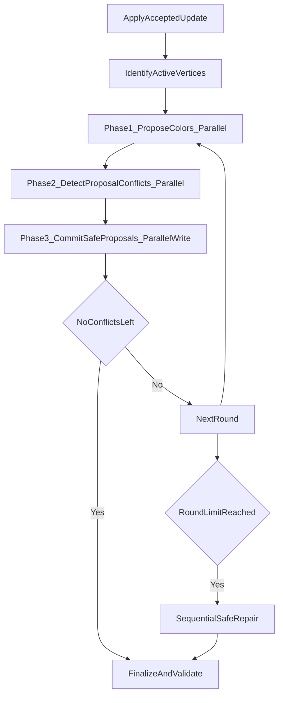

# PAR-Relaxed Stage Plan (`docs/stages/par_relaxed.md`)

## 1. Goal and non-goals

### Goal
Implement a C++17 + ParlayLib `PAR-Relaxed` dynamic coloring baseline that:
- Uses a relaxed palette size `palette_size = c * delta_cap + 1`.
- Preserves proper coloring (no adjacent equal colors) after each completed accepted update/batch.
- Uses phase-separated parallel rounds with deterministic randomness and bounded retries.
- Falls back to a sequential safe repair if rounds do not converge.

### Non-goals
- Do not implement `SEQ-Exact` or `PAR-Exact` in this stage.
- Do not implement paper-specific level/timestamp cascade logic.
- Do not change `GraphStore` semantics/invariants.
- Do not introduce external dependencies.
- Do not optimize for maximal throughput at the cost of correctness.

## 2. Relationship to final project algorithms

- `SEQ-Baseline` remains the correctness-first exact sequential reference.
- `PAR-Relaxed` is independent of `SEQ-Exact`: it does not depend on paper-specific level/timestamp cascade logic and can be implemented before `SEQ-Exact`.
- `PAR-Relaxed` is a practical parallel baseline that isolates parallel update mechanics (rounds, conflict resolution, commit barriers).
- Later comparisons should include `SEQ-Baseline`, `PAR-Exact`, and `graph_store_only` in benchmark reporting.
- Later `PAR-Exact` can reuse this stage's test/benchmark plumbing and phase-separated structure while changing coloring logic to exact `Delta+1` semantics.

## 3. Existing files to inspect

Primary interfaces and current behavior:
- [`include/dgcolor/coloring_engine.hpp`](include/dgcolor/coloring_engine.hpp)
- [`include/dgcolor/seq_baseline_engine.hpp`](include/dgcolor/seq_baseline_engine.hpp)
- [`src/seq_baseline_engine.cpp`](src/seq_baseline_engine.cpp)
- [`include/dgcolor/validator.hpp`](include/dgcolor/validator.hpp)
- [`src/validator.cpp`](src/validator.cpp)
- [`benchmarks/bench_smoke.cpp`](benchmarks/bench_smoke.cpp)
- [`tests/test_seq_baseline.cpp`](tests/test_seq_baseline.cpp)
- [`tests/test_seq_baseline_fuzz.cpp`](tests/test_seq_baseline_fuzz.cpp)
- [`tests/CMakeLists.txt`](tests/CMakeLists.txt)
- [`benchmarks/CMakeLists.txt`](benchmarks/CMakeLists.txt)

Essential current contracts/snippets:
```13:25:include/dgcolor/coloring_engine.hpp
virtual std::string name() const = 0;
virtual const GraphStore& graph() const = 0;
virtual Color color_of(VertexId v) const = 0;
virtual parlay::sequence<Color> colors() const = 0;
virtual void initialize_coloring() = 0;
virtual UpdateStats apply_update(const EdgeUpdate& update) = 0;
virtual BatchStats apply_batch(const UpdateBatch& batch) = 0;
```

```63:75:include/dgcolor/batch.hpp
struct UpdateStats {
  bool applied{false};
  std::size_t edges_changed{0};
  std::size_t vertices_touched{0};
  double seconds{0.0};
};

struct BatchStats {
  bool applied{false};
  std::size_t updates{0};
```

```92:117:src/validator.cpp
ValidationResult validate_exact_coloring(const GraphStore& graph,
                                         const parlay::sequence<Color>& colors) {
  ...
  if (colors[u] == colors[v]) {
    return Fail("adjacent vertices share color ...");
  }
}
```

```40:44:benchmarks/bench_smoke.cpp
if (cfg->engine != "graph_store_only" && cfg->engine != "seq_baseline") {
  throw std::invalid_argument("invalid --engine ...");
}
```

## 4. Files to create or modify

### Create
- [`include/dgcolor/par_relaxed_engine.hpp`](include/dgcolor/par_relaxed_engine.hpp)
- [`src/par_relaxed_engine.cpp`](src/par_relaxed_engine.cpp)
- [`tests/test_par_relaxed.cpp`](tests/test_par_relaxed.cpp)
- [`tests/test_par_relaxed_fuzz.cpp`](tests/test_par_relaxed_fuzz.cpp)

### Modify
- [`benchmarks/bench_smoke.cpp`](benchmarks/bench_smoke.cpp)
- [`benchmarks/CMakeLists.txt`](benchmarks/CMakeLists.txt)
- [`tests/CMakeLists.txt`](tests/CMakeLists.txt)
- [`README.md`](README.md) (engine flags/status only)

## 5. Proposed PAR-Relaxed engine interface

`ParRelaxedEngine final : public ColoringEngine` with constructor:
- `ParRelaxedEngine(VertexId num_vertices, Degree delta_cap, std::uint64_t seed, std::uint32_t palette_multiplier, std::uint32_t max_rounds)`
- Optional overload with `initial_updates` batch (same pattern as baseline).

Internal state:
- `AdjacencyGraphStore graph_`
- `parlay::sequence<Color> colors_`
- deterministic seed state / per-round pseudo-random salt
- `std::uint32_t palette_multiplier_`
- `Color palette_size_`
- `std::uint32_t max_rounds_`
- `bool initialized_`
- stats accumulators (last/total rounds, recolors, fallbacks, unresolved conflicts)

Public API compatibility:
- Keep `ColoringEngine` methods unchanged.
- Add lightweight engine-specific getters for benchmark stats (non-virtual, const).

## 6. Palette convention and c-parameter handling

- Enforce `c >= 1`; default to `c=2` for smoke benchmarks.
- Compute with overflow checks: `palette_size = c * delta_cap + 1`.
- Color range invariant: `0 <= color <= palette_size - 1` for all vertices once initialized.
- Keep `kUncolored` only for temporary internal initialization states, not post-operation states.
- Benchmark/test output should include both `palette_multiplier` and `palette_size`.

Clarification of "relaxed":
- Relaxed means using a larger palette than exact `Delta+1` coloring.
- Relaxed does not mean allowing conflicts.
- After every completed accepted update or batch, coloring must remain proper (no adjacent equal colors).

## 7. Algorithm design

Initialization:
- Build an initial proper coloring using relaxed greedy policy over full vertex set.

After accepted update/batch:
- Identify impacted set (`u/v` endpoints and optionally their neighbors depending on op kind).
- Run parallel relaxed conflict-resolution rounds over active vertices only.
- In each round, each active vertex proposes a color using deterministic pseudo-random tie breaking and local forbidden-color scan.
- Commit only proposals marked safe in conflict detection phase.
- Stop early when no active conflicts remain.
- If round cap is hit with unresolved conflicts, run sequential safe repair over unresolved region (or full graph if simpler first cut).

Determinism note:
- Do not use shared mutable RNG state inside parallel loops.
- For parallel proposals, prefer deterministic hash-style candidate generation based on `(seed, round, vertex_id, attempt)`.
- This keeps repeated runs with the same seed reproducible on Linux cluster builds/tests.

## 8. Phase-separated parallel update design



Phase rules:
- No interleaved read/write on `colors_` within a phase.
- Use separate proposal buffers (`proposed_colors`, `proposal_valid`, `wins_conflict`) to avoid races.
- Deterministic conflict winner should use a stable rule (for example lower vertex id first).

## 9. Correctness invariants

Must always hold after `initialize_coloring`, accepted `apply_update`, accepted `apply_batch`:
- Graph invariants remain valid (delegated to `AdjacencyGraphStore`).
- All colored vertices are in relaxed range `[0, c * delta_cap]`.
- Proper coloring: no adjacent equal colors.
- Rejected update/batch leaves graph and colors unchanged.
- `apply_batch` remains atomic with respect to topology mutation results returned by `GraphStore`.

## 10. Convergence and fallback strategy

- `max_rounds` controls parallel relaxation limit per operation.
- Track unresolved conflicted vertices each round and terminate when this count reaches zero.
- If unresolved conflicts remain after `max_rounds`:
  - increment fallback counter,
  - run deterministic sequential safe repair (greedy recolor on unresolved-induced set, with option to escalate to full recolor),
  - revalidate strict proper coloring.
- If repair cannot find a proper coloring within the configured relaxed palette, throw a runtime error with diagnostics.

Fallback-first recommendation:
- In early implementation, accepted update/batch handling may initially use full sequential greedy recolor after topology mutation.
- Then progressively replace that path with phase-separated parallel rounds.
- Establish correctness first, then optimize for performance.

## 11. Stats and metrics to collect

Per operation/internal:
- `last_rounds`
- `total_rounds`
- `recolored_vertices_total`
- `fallback_count`
- `unresolved_conflict_count_last`
- `vertices_touched_last`

Benchmark printouts:
- Existing smoke metrics remain.
- Add:
  - `palette_multiplier`
  - `palette_size`
  - `total_rounds`
  - `fallback_count`
  - `vertices_touched_total`
- Enforce:
  - `graph_validated=1`
  - `coloring_validated=1`

## 12. Exact implementation steps in order

1. Engine skeleton + initialization only.
2. Single-update path with correctness-first fallback.
3. Batch path.
4. Parallel round refinement.
5. Deterministic fuzz/stress tests.
6. Benchmark integration.
7. Documentation/completion summary.

## 13. Unit tests to add

`test_par_relaxed.cpp`:
- Initialization:
  - empty graph
  - no-edge graph
  - path
  - cycle
  - star
  - near-delta-cap graph
- Single updates:
  - insertion without conflict
  - insertion with conflict
  - deletion
  - rejected update stability (graph + colors unchanged)
- Batch updates:
  - accepted insertion batch
  - accepted mixed batch
  - rejected batch stability
- For each accepted operation: validate graph invariants, proper coloring, and relaxed color range.

Validator-plan note:
- Existing `validate_exact_coloring()` checks proper coloring but does not enforce a relaxed palette upper bound.
- PAR-Relaxed tests should explicitly check color range against `palette_size`.
- Consider later adding a helper such as `validate_coloring_with_palette(graph, colors, palette_size)`.

## 14. Deterministic fuzz/stress tests to add

`test_par_relaxed_fuzz.cpp`:
- Fixed seed matrix (e.g. `1,2,3,5,8`), small graph sizes, varied `delta_cap`.
- `c in {2,4,8}` and several `max_rounds` values.
- Mix single and batched operations.
- On every successful operation:
  - validate graph invariants,
  - validate proper coloring (and explicit color-range checks),
  - verify color range bound.
- On rejected operation:
  - verify unchanged edge count,
  - verify unchanged full color vector,
  - verify topology unchanged vs mirror store.

## 15. Benchmark integration plan

`bench_smoke` updates:
- Parse additional args:
  - `--engine par_relaxed`
  - `--palette-multiplier` (alias `--c`)
  - `--max-rounds`
- Instantiate `ParRelaxedEngine` when selected.
- Validate using graph invariants + proper-coloring checks.
- Output naming:
  - `engine_name=par_relaxed` or `engine_name=par_relaxed_c<c>`
- Output additional required metrics:
  - `palette_size`, `palette_multiplier`, `total_rounds`, `fallback_count`, `vertices_touched_total`.

## 16. Risks and fallback simplifications

Risks:
- Parallel rounds may oscillate on adversarial updates.
- Nondeterminism from parallel proposal order if not carefully tie-broken.
- Overly broad active-set recomputation may reduce speedup.

Fallback simplifications (acceptable for this stage):
- Use conservative active-set expansion first (endpoints + neighbors).
- Use simple deterministic winner rule (minimum vertex id) for proposal conflicts.
- If unresolved remains, run full sequential greedy recolor within the relaxed palette for guaranteed correctness; optimize scope later.

## 17. Acceptance criteria

Stage is complete when all are true on Linux cluster:
- New `ParRelaxedEngine` compiles and is selectable in benchmarks.
- All existing tests still pass.
- New `par_relaxed` unit tests pass.
- New deterministic `par_relaxed_fuzz` tests pass.
- `bench_smoke --engine par_relaxed ...` runs successfully and prints required metrics.
- Reported validations show `graph_validated=1` and `coloring_validated=1`.
- Rejected updates/batches preserve graph and coloring state.
- No project-code changes are introduced solely to work around macOS SDK header/toolchain issues.
